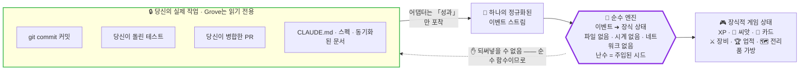
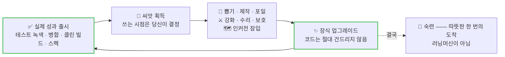
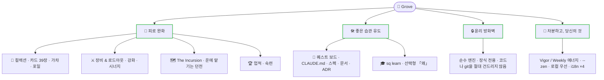

<div align="center">

# 🌳 Grove

**로컬 우선, 도구 무관한 AI 코딩용 게임 레이어.**

코딩 세션의 보이지 않는 성과들(테스트 녹색, 병합된 PR, 클린 빌드, 작성된 `CLAUDE.md`)
을 전리품, XP, 컬렉션으로 바꿉니다. 미루던 습관 잡일은 퀘스트로 바꿉니다. 모두 장식이고, 모두 차분하며, 모두 내 것입니다.

[](LICENSE)


-8a2be2.svg)


[English](README.md) · [简体中文](README.zh-CN.md) · [日本語](README.ja.md) · **한국어**

</div>

---

Grove는 실용적인 생산성 도구킷 위에 얹힌 재미있는 껍질입니다. 모든 보상은 안전하고 선택적인 워크플로 파워업과 연결됩니다
(초안 커밋 메시지, 비파괴적 체크포인트, 갱신된 코드 맵). 여러분의 코드, 커밋, 문서, git 기록은
어떤 게임 결과로도 **절대** 수정되거나 유실되거나 불이익을 받지 않습니다. 엔진은 순수 함수이며
보상은 *구조적으로* 장식 전용입니다 ([`docs/decisions.md`](docs/decisions.md), ADR-0005 참조).

```text
$ git commit -m "docs: write CLAUDE.md"
  🌳 grove
  🌿 CLAUDE.md 작성 · 영구 오라
  🃏 Compiler · uncommon            ← 습관 신호가 처음 감지되면 카드 드롭
  🌅 첫 빛 · 빌드 첫 통과
```

어차피 할 일을 했습니다. Grove는 그걸 알아챌 뿐입니다.

## 왜 만들었나

두 가지 축, 하나의 정규화된 이벤트 스트림:

- 🍃 **피로 해소** · 보이지 않는 성과(테스트 녹색, 병합, 빌드)가 전리품 / XP / 컬렉션이 됩니다.
- 🛠️ **좋은 습관 유도** · 미루던 잡일(`CLAUDE.md` 작성, 스펙 작성, 문서 동기화)이 퀘스트 / 버프가 됩니다.

신호는 도구별 얇은 어댑터가 수집하고 **순수** 엔진이 환원하므로, Grove는 *어떤* AI 코딩 워크플로에서도 동작합니다 · Claude Code, Cursor, Aider, Codex / Copilot / Gemini CLI, 또는 순수 터미널 + git.
도구당 어댑터 하나, 결합도 없음.



화살표는 **한 방향뿐**입니다. 성과가 *들어오고*, 전리품이 *나갑니다*. 당신의 코드·커밋·git 기록은 엔진이 넘을 수 없는 벽의 읽기 전용 쪽에 있습니다 (ADR-0005).

## 60초 빠른 시작

```sh
# 1. 설치 (패키지: grovekit · 전역 바이너리: sq)
npm i -g grovekit            # 또는 설치 없이 임시 실행: npx -p grovekit sq <cmd>

# 2. 이미 작업 중인 저장소에 Grove 연결 (기존 훅에 체인 · 절대 덮어쓰지 않음)
cd my-project
sq init                      # 페일 오픈 post-commit 훅 + 시작 보조금; 커밋을 절대 차단하지 않음

# 3. 평소대로 커밋 · Grove는 커밋의 좋은 습관 신호를 채점함 (테스트를 직접 실행하지 않음)
git commit -m "docs: write CLAUDE.md"

# 4. 하나의 인플레이스 패널에서 전체 확인 (스크롤 로그가 아님)
sq dashboard                 # XP · 씨앗 · 장비 · 퀘스트 · 버프 · 에너지

# 5. 루프: 성과 출시로 🌰 씨앗을 버는 것 · 언제 쓸지는 직접 결정
sq pull                      # 씨앗 45개로 가챠 뽑기 (없으면 차분히 거부)

# 6. 어떤 습관이 왜 중요한지 궁금하다면? 직접 물어보세요 · 선택, 강요 없음
sq learn test-first          # 한 줄: 먼저 실패하는 테스트가 의도한 동작을 고정하는 이유
```

> 전역 설치를 원하지 않는다면? 모든 명령은 `npx -p grovekit sq <cmd>` 로 실행할 수 있습니다.

## 핵심 루프



Grove는 **성과에만 보상하며, 단순 활동에는 보상하지 않습니다** · 코드 줄 수, 커밋 수, 작업 시간 노가다 없음. 테스트가 빨간 것은 아무 손해가 없으며, 재기(빨간색 → 다시 녹색)는 따뜻한 한 줄을 줍니다. 퀘스트를 건너뛰는 것은 항상 괜찮습니다. 조용한 글리프, 절대로 "아직 안 하셨나요..."가 없습니다.

## 주요 기능

게임 전체가 두 기둥 —— *피로 완화*, *좋은 습관 유도* —— 에서 자라며, 방화벽으로 둘러싸여 차분하게 유지됩니다:



| | |
|---|---|
| 🎴 **컬렉션** | 카드 세트 7개 · 카드 39장 · 천장 + `--spark` 확정 보증이 있는 가챠 뽑기; 없는 카드 제작(craft) 및 보유 카드에 장식적 포일(foil) 적용 (갱신 가능한 조각 소모처, 완전 제작 가치를 넘어서면 감소). |
| ⚔️ **장비 & 로드아웃** | 위험·보상의 `enhance` / `repair` / `protect` 루프, 3슬롯 로드아웃, 장착한 카드/장비/버프 간 8가지 장식적 시너지 (ADR-0014). |
| 🗺️ **The Incursion (던전)** | **던전**: 운에 맡기는 로그라이크 런. 빌드를 챙겨 시드 기반 관문에 잠입하고, 다양한 층 유형(**엘리트**=고난도·고보상 · **트레저**=안전한 대박 · **레스트**=회복)을 지나며, 일회용 **실드**를 챙기고 2단계 **보스**에 도전 —— 하지만 전리품은 **살아서 탈출**해야 당신 것입니다. 너무 깊이 들어가 죽으면 가방째 몰수. 진짜 판돈이지만 **100% 장식 전용**: 당신의 코드·커밋·git은 결코 건드리지 않습니다 (ADR-0005). |
| 🏆 **인정** | 소급 인정되는 **업적** 13개 (FOMO 없음), 엔드게임 러닝머신을 끝내는 원샷 **숙련** 도달, **재기** (막혔던 테스트가 드디어 녹색), **첫 빛** (첫 번째 녹색 빌드). |
| 📜 **좋은 습관** | 습관 퀘스트 보드 (`CLAUDE.md` 작성, 스펙, 계획, 문서 동기화, `docs/decisions.md`에 **결정 기록**) 및 `sq learn` · 입문자와 베테랑 모두를 위한 선택적 한 줄 *이유* 제공. |
| 🔋 **번아웃 방지 에너지** | Claude Code의 5h/7d 쿼터가 **활력(Vigor) / 주간(Weekly)** 에너지로 표현되며, *남은* 양을 보여줌 (절대 "소진됨"이 아님); 무제한 플랜은 차분한 "샘(Wellspring)"으로 표시, 인위적 희소성 없음. 모든 저장소에서 계정 전역 적용. |
| 🖥️ **인터페이스** | 인플레이스 `sq dashboard`, 탐색 가능한 Ink **TUI** (`sq tui`), 읽기 전용 웹/SSE 대시보드 (`sq serve`), 요약 (`sq recap --since week`). |
| 🌍 **차분함 & 글로벌** | 모든 스펙터클을 조용한 ✓ 하나로 줄이는 `--zen` 모드, en / zh-CN / ja / ko 완전 **i18n** 지원. |
| 🤝 **커먼즈** | `sq commons` (선택): 라벨된 커뮤니티 작업 신청, AI가 패치 초안 작성, *직접* 검토 후 PR 오픈 · 병합된 PR은 실제 성과입니다. Grove는 기여자 코드를 작성하거나 실행하지 않습니다 (ADR-0013). |

## 명령어 (`sq help`로 전체 목록 확인)

| 명령어 | 기능 |
|---|---|
| `sq init` / `sq uninstall` | 체인 안전 post-commit 훅 설치 / 제거 |
| `sq wrap -- <cmd>` | 평소에 실행하는 명령어를 실행; 녹색은 보상, 빨간색은 보상 없음 (ADR-0003) |
| `sq scan [path]` | 저장소에서 습관 신호(그리모아 / 테스트 / 문서 / 스펙 / 결정)를 스캔하고 보상 |
| `sq dashboard` · `sq tui` · `sq serve` | 보드: 인플레이스 패널 · 탐색 가능한 TUI · 읽기 전용 웹/SSE |
| `sq quests` · `sq achievements [--all]` | 습관 퀘스트 보드 · 소급 인정 업적 |
| `sq learn [practice]` | 어떤 실천이 왜 중요한지 선택적으로 한 줄 확인 (자동 표시 안 함) |
| `sq pull [--premium] [--spark <id>]` | 🌰 씨앗으로 가챠 뽑기 · 타이밍은 직접 결정 |
| `sq craft <id>` · `sq foil [id]` · `sq convert [n]` | 조각 소모처: 없는 카드 제작, 보유 카드 포일, 잉여 조각을 씨앗으로 환전 |
| `sq enhance <ref>` · `sq repair <ref>` · `sq protect <ref>` | 장비 위험·보상 루프 (장식 전용) |
| `sq incursion start [--kit shield]` · `dive` · `escape` · `history` | **던전**: 시드 기반 로그라이크 런에 잠입해 층 아키타입과 2단계 보스를 돌파; 살아서 탈출할 때만 전리품 획득 (장식 판돈) |
| `sq suggest-commit` | 읽기 전용: 스테이징된 diff에서 커밋 메시지 초안 생성 (커밋하지 않음) |
| `sq checkpoint` | 비파괴적 `git stash create` 스냅샷 + 휴식 버프 |
| `sq statusline install` / `uninstall` | Claude Code 상태줄에 Grove 체인 연결 (에너지 미터) |
| `sq statusline-segment` | 차분하고 조합 가능한 한 줄 개요(레벨 · 경험치 · 에너지)를 자신의 바에 연결 |
| `sq export [file]` · `sq import <file>` | 데이터 소유권: 이식 가능한 버전 관리 상태 (import는 먼저 백업, 잘못된 파일은 거부) |
| `sq share [--badge]` · `sq ntfy <topic>` | 선택, 프라이버시 최소화: 공유 카드 / README 배지 · 주요 순간에 모바일 푸시 (기본값 **꺼짐**) |
| `sq status [--json]` · `sq recap [--since session\|week\|all] [--csv]` | 평문 상태 · 차분한 회고 · `--json` / `--csv`로 성과 데이터 내보내기 (파일이나 jq로 파이프) |

## 윤리 방화벽

이것은 핵심 약속이며, 선한 의도가 아닌 구조적으로 강제됩니다:

> 엔진은 **순수 함수**입니다: `이벤트 → 장식적 게임 상태`. 파일시스템도, 클락도, 네트워크도,
> 주입된 시드 외의 난수도 없습니다. 따라서 실제 작업을 건드리는 것이 *원천적으로 불가능*합니다.

- **보상은 장식, 절대 실제 능력 부여 없음** · 어떤 게임 결과도 실제 기능을 제공하지 않습니다; 카드는 카드일 뿐입니다.
- **테스트 자동 실행 없음** · 신호는 이미 여러분이 하는 일에서 옵니다 (ADR-0003).
- **git 훅·상태줄 절대 덮어쓰지 않음** · Grove는 체인으로 연결되며 완전히 복원 가능합니다 (ADR-0004).
- **성과 기반, 활동 기반 아님** · 코드 줄 수 / 커밋 수 / 작업 시간 / 잃을 연속 기록 없음. 관대하고, 수치 없고, 차분한 모드.
- **로컬 우선 & 프라이빗** · 상태는 로컬 디스크에 저장됩니다; `share` / `ntfy`는 기본값 꺼짐이며 장식적 통계만 전송, 코드·작업 디렉토리·비용은 절대 포함하지 않습니다 (ADR-0011).

## 포지셔닝

Grove는 검증된 성과 기반 게임화, AI 지원 코딩, AI 쿼터 에너지, 전리품/장비/가챠, 로컬 우선 프라이버시, 윤리 방화벽을 하나의 도구 무관 CLI에 **결합한** 첫 번째 도구입니다.

| | Grove | claude-quest | code-tamagotchi | Habitica | Gamekins |
|---|---|---|---|---|---|
| 성과 기반 보상 (검증됨) | ✅ 종료 코드 + git diff | 부분적 | ❌ 활동 기반 | 수동 | ✅ CI 전용 |
| 전리품 / 장비 / 가챠 | ✅ | ❌ | ❌ | 일반적 | ❌ |
| AI 도구 무관 | ✅ 모든 도구 | ❌ CC 전용 | ❌ CC 전용 | 일반적 | ❌ JVM |
| AI 쿼터 → 게임 에너지 | ✅ 활력/주간 | ❌ | ❌ | ❌ | ❌ |
| 윤리 방화벽 (순수 엔진) | ✅ 구조적 | 불명확 | ❌ 패널티 있음 | 장식적 | 부분적 |
| 로컬 우선, 서버 없음 | ✅ | ❌ 클라우드 | 부분적 | ❌ | ❌ |
| 차분 / zen 모드 | ✅ | ❌ | ❌ | ❌ | ❌ |

각 요소는 *어딘가에* 존재하지만, 이 조합 전체는 Grove 외에 없습니다. 전체 분석:
[`docs/PRIOR-ART.md`](docs/PRIOR-ART.md).

## 출시됨 vs. 로드맵 (솔직한 범위)

**출시됨:** 순수 엔진(XP, 가챠, 장비, 컬렉션, 퀘스트, 에너지, 치명타, 시너지), 하위 호환 마이그레이션이 포함된 영속성, 체인 안전 git 훅, `sq scan` / `sq wrap`, 씨앗 경제 및 모든 소모처
(`pull` / `craft` / `foil` / `convert` / `enhance` / `repair` / `protect`), 대시보드 / TUI / 웹-SSE 인터페이스, 업적 / 숙련 / 재기 / 첫 빛, 습관 퀘스트 보드 + `sq learn`, 계정 전역 에너지,
`--zen`, 선택적 `share` / `ntfy`, `export` / `import`, 커먼즈 P0 클라이언트, en/zh-CN/ja/ko i18n.

**로드맵 (미출시):** 친구 연속 기록 / 협동, 선택적 리그 기반 **글로벌 리더보드** · 다크 패턴 없이 출시하려면 **서버 검증 성과 백엔드**가 필요하므로 (로컬 상태는 위조 가능) 보류 중입니다 (ADR-0011).

## 소스에서 빌드

```sh
npm install
npm run build            # src/cli/sq.ts → dist/cli/sq.js 번들링 (ESM, 실행 바이너리)
node dist/cli/sq.js help
npm test                 # vitest (TDD; 커버리지 목표 80%+)
npm run typecheck        # tsc --noEmit
```

## 문서

- [`CLAUDE.md`](CLAUDE.md) · 제약 사항 + 레이아웃 인덱스
- [`docs/decisions.md`](docs/decisions.md) · Architecture Decision Records (방화벽, 도구 무관 어댑터, 훅 체이닝...)
- [`docs/ARCHITECTURE.md`](docs/ARCHITECTURE.md) · 모듈, 순수/비순수 경계, 이벤트 스키마
- [`docs/GOALS.md`](docs/GOALS.md) · 목표 & 비목표
- [`docs/PROJECT-CONTEXT.md`](docs/PROJECT-CONTEXT.md) · 현재 상태 & 마일스톤

## 라이선스

[MIT](LICENSE).
