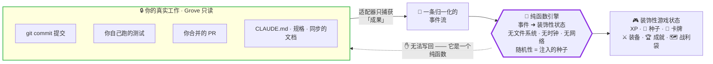
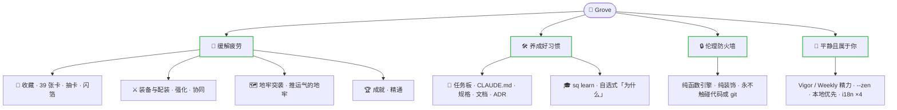

<div align="center">

# 🌳 Grove

**本地优先、工具无关的 AI 辅助编码游戏层。**

把一次编码 session 里那些隐形的胜利(测试转绿、PR 合并、干净构建、写好 `CLAUDE.md`)
变成战利品、XP 和一份收藏。把你一直拖着没做的杂务变成任务。纯装饰，始终平静，完全属于你。

[](LICENSE)


-8a2be2.svg)


[English](README.md) · **简体中文** · [日本語](README.ja.md) · [한국어](README.ko.md)

</div>

---

Grove 是一层套在真实效率工具之上的趣味皮肤。每一条奖励都对应一个安全的、可选接入的工作流增强
（起草提交信息、无损检查点、刷新代码地图）。你的代码、提交、文档和 git 历史
**永远**不会被任何游戏结果修改、丢失或惩罚 · 引擎是纯函数，奖励在结构上*只是装饰*
（见 [`docs/decisions.md`](docs/decisions.md)，ADR-0005）。

```text
$ git commit -m "docs: write CLAUDE.md"
  🌳 grove
  🌿 CLAUDE.md 已写 · 永久光环
  🃏 Compiler · 罕见            ← 习惯信号首次命中时掉落一张卡牌
  🌅 初见曙光 · 构建首次转绿
```

你本来就在做这些工作。Grove 只是注意到了。

## 为什么

两根支柱，一条统一的事件流：

- 🍃 **缓解疲劳** · 隐形胜利（测试转绿、合并、构建通过）变成战利品 / XP / 收藏。
- 🛠️ **培养好习惯** · 你一直拖着的杂务（写 `CLAUDE.md`、写规格、保持文档同步）变成任务 / 增益。

信号由每个工具的薄适配层捕获，交由**纯函数**引擎处理，因此 Grove 适用于*任何*
AI 编码工作流 · Claude Code、Cursor、Aider、Codex / Copilot / Gemini CLI，或者普通终端 + git。
每个工具一个适配器，零耦合。



箭头**只指向一个方向**。成果流*入*，战利品流*出*；你的代码、提交与 git 历史，都处在这堵引擎无法越过的墙的只读一侧（ADR-0005）。

## 60 秒快速上手

```sh
# 1. 安装（包名: grovekit · 全局命令: sq）
npm i -g grovekit            # 或免安装临时使用: npx -p grovekit sq <cmd>

# 2. 接入你已有的仓库（链接现有钩子，绝不覆盖）
cd my-project
sq init                      # 失败开放式 post-commit 钩子 + 初始赠送；绝不阻塞提交

# 3. 正常提交 · Grove 从提交中识别良好实践信号（不会自动跑你的测试）
git commit -m "docs: write CLAUDE.md"

# 4. 一屏看全（原位面板，非滚动日志）
sq dashboard                 # XP · 种子 · 装备 · 任务 · 增益 · 精力

# 5. 核心循环：交付成果赚 🌰 种子；你决定何时花出去
sq pull                      # 花 45 🌰 进行一次抽卡（余额不足时平静拒绝）

# 6. 好奇某个习惯为何重要？主动查询 · 自选，绝不催促
sq learn test-first          # 一行说明：为什么先写一个失败的测试能锁定预期行为
```

> 不想全局安装？所有命令均可通过 `npx -p grovekit sq <cmd>` 使用。

## 核心循环


Grove **只奖励成果，从不奖励原始活动** · 没有代码行数、提交次数或工时磨刷。
测试变红不会扣分；逆转（红 → 再次转绿）只换来一行温馨提示。跳过任务完全没问题：
安静的字符符号，从不"你还没有……"。

## 功能亮点

整个游戏从两大支柱生长 —— *缓解疲劳*、*养成好习惯* —— 由防火墙护栏围住，并始终保持平静：



| | |
|---|---|
| 🎴 **收藏** | 7 个套牌 · 39 张卡牌 · 抽卡（gacha）含保底 + `--spark` 定向保底；合成缺失卡牌，并为已有卡牌装饰性**闪箔**（可续的碎片消耗，超出完整合成价值后边际递减）。 |
| ⚔️ **装备与配装** | 风险与收益兼备的 `enhance` / `repair` / `protect` 循环，3 槽位配装（loadout），以及装备卡牌、装备与增益之间的 8 种装饰性协同（synergy，ADR-0014）。 |
| 🗺️ **地牢突袭（The Incursion）** | **地牢**：一场推运气的 roguelike 探险。带上你的构筑，潜入随机生成的层层关卡，途中有不同地形（**精英**层更难更肥 · **宝藏**层稳妥大赚 · **休整**层回血），可携带一次性**护盾**，并挑战两阶段 **Boss** —— 但战利品只有**活着逃出**才归你；潜得太深而阵亡，整袋战利品作废。真实的赌注，却**100% 纯装饰**：你的代码、提交与 git 永不受影响（ADR-0005）。 |
| 🏆 **认可** | 13 个可推导**成就**（retroactive，无 FOMO），一次性**精通**（mastery）到达终止终局跑步机，**逆转**（comeback，测试组终于重新转绿），以及**初见曙光**（first light，首次构建转绿）。 |
| 📜 **好习惯** | 习惯任务看板（写 `CLAUDE.md`、规格、计划、保持文档同步、在 `docs/decisions.md` **记录决策**）和 `sq learn` · 自选的一行「为什么」，对新手和老手都适用。 |
| 🔋 **防燃尽精力** | 你的 Claude Code 5h/7d 配额变成**元气（Vigor）/ 本周（Weekly）**精力，展示*剩余*值（而非"已消耗"）；无计量计划显示平静的"源泉（Wellspring）"，从不制造虚假稀缺。跨全部仓库的账号级全局状态。 |
| 🖥️ **界面** | 原位 `sq dashboard`，可导航的 Ink **TUI**（`sq tui`），只读 web/SSE 仪表板（`sq serve`），以及回顾（`sq recap --since week`）。 |
| 🌍 **平静 · 全球化** | `--zen` 模式将所有视觉效果裁减为安静的 ✓，以及完整的 **i18n**：en / zh-CN / ja / ko。 |
| 🤝 **共建** | `sq commons`（可选接入）：认领带标签的社区任务，由你的 AI 起草补丁，由*你*审阅，再由*你*开 PR · 合并的 PR 才是真实成果。Grove 从不编写或运行贡献者代码（ADR-0013）。 |

## 命令（运行 `sq help` 查看完整列表）

| 命令 | 说明 |
|---|---|
| `sq init` / `sq uninstall` | 安装 / 移除链接安全的 post-commit 钩子 |
| `sq wrap -- <cmd>` | 运行你本来就会运行的命令；绿色授予奖励，失败不授予任何奖励（ADR-0003） |
| `sq scan [path]` | 扫描仓库中的习惯信号（魔典 / 测试 / 文档 / 规格 / 决策）并给予奖励 |
| `sq dashboard` · `sq tui` · `sq serve` | 看板：原位面板 · 可导航 TUI · 只读 web/SSE |
| `sq quests` · `sq achievements [--all]` | 习惯看板 · 回顾性认可 |
| `sq learn [practice]` | 自选的一行「为什么」（从不自动显示） |
| `sq pull [--premium] [--spark <id>]` | 花 🌰 种子抽卡 · 你决定何时 |
| `sq craft <id>` · `sq foil [id]` · `sq convert [n]` | 碎片消耗：合成缺失卡牌、为已有卡牌上闪箔、将多余碎片换回种子 |
| `sq enhance <ref>` · `sq repair <ref>` · `sq protect <ref>` | 装备风险与收益循环（纯装饰） |
| `sq incursion start [--kit shield]` · `dive` · `escape` · `history` | **地牢**：潜入随机生成的 roguelike 探险，穿越各种地形与两阶段 Boss；只有活着逃出才能收入战利品（纯装饰赌注） |
| `sq suggest-commit` | 只读：从暂存差异起草提交信息（从不提交） |
| `sq checkpoint` | 无损 `git stash create` 快照 + 休息增益 |
| `sq statusline install` / `uninstall` | 将 Grove 接入 Claude Code 状态栏（精力计量） |
| `sq statusline-segment` | 一行平静、可组合的 Grove 概览（等级 · 经验 · 精力），接进你自己的状态栏 |
| `sq export [file]` · `sq import <file>` | 数据自主：可移植的带版本存档（导入先备份，拒绝损坏文件） |
| `sq share [--badge]` · `sq ntfy <topic>` | 可选 · 隐私最小化：分享卡 / README 徽章 · 重要时刻移动推送（默认**关闭**） |
| `sq status [--json]` · `sq recap [--since session\|week\|all] [--csv]` | 纯文本状态 · 平静回顾 · 用 `--json` / `--csv` 导出你的成果数据（管道到文件或 jq） |

## 伦理防火墙

这是结构性保证，不是靠善意维持的承诺：

> 引擎是**纯函数**：`events → cosmetic game-state`。它没有文件系统、没有时钟、没有网络，
> 除注入的随机种子外没有任何随机性。因此它在结构上*无法*触碰你的真实工作。

- **奖励是装饰，而非能力** · 任何游戏结果都不赋予真实能力；卡牌就是卡牌。
- **从不自动跑你的测试** · 信号来自你本就会做的事（ADR-0003）。
- **从不覆盖**你的 git 钩子或状态栏 · Grove 以链接方式接入，完全可还原（ADR-0004）。
- **成果，而非活动** · 没有代码行数 / 提交次数 / 工时 / 会断的连胜。宽容，无羞辱，平静模式。
- **本地优先 · 私密** · 状态存于你的磁盘；`share` / `ntfy` 默认关闭，仅传输装饰性统计，
  从不含代码、当前目录或费用（ADR-0011）。

## 竞品对比

Grove 是首个将**已验证成果游戏化**与 AI 辅助编码、AI 配额精力、战利品/装备/抽卡、本地优先隐私
以及伦理防火墙**融合**于一体的工具无关 CLI。

| | Grove | claude-quest | code-tamagotchi | Habitica | Gamekins |
|---|---|---|---|---|---|
| 成果门控奖励（已验证） | ✅ 退出码 + git diff | 部分 | ❌ 活动计数 | 手动 | ✅ 仅 CI |
| 战利品 / 装备 / 抽卡 | ✅ | ❌ | ❌ | 通用 | ❌ |
| AI 工具无关 | ✅ 全工具 | ❌ 仅 CC | ❌ 仅 CC | 通用 | ❌ JVM |
| AI 配额 → 游戏精力 | ✅ 元气/本周 | ❌ | ❌ | ❌ | ❌ |
| 伦理防火墙（纯函数引擎） | ✅ 结构性 | 不明 | ❌ 有惩罚 | 装饰 | 部分 |
| 本地优先，无服务器 | ✅ | ❌ 云端 | 部分 | ❌ | ❌ |
| 平静 / zen 模式 | ✅ | ❌ | ❌ | ❌ | ❌ |

每个维度都在*某处*存在，但把它们融合在一起的只有 Grove。完整分析见
[`docs/PRIOR-ART.md`](docs/PRIOR-ART.md)。

## 已交付 vs. 路线图（诚实的范围说明）

**已交付：** 纯函数引擎（XP、抽卡、装备、收藏、任务、精力、暴击、协同），含前向兼容迁移的持久化，
链接安全的 git 钩子，`sq scan` / `sq wrap`，种子经济体系及全部消耗渠道
（`pull` / `craft` / `foil` / `convert` / `enhance` / `repair` / `protect`），
dashboard / TUI / web-SSE 界面，成就 / 精通 / 逆转 / 初见曙光，
习惯任务看板 + `sq learn`，账号级全局精力，`--zen`，可选的 `share` / `ntfy`，
`export` / `import`，共建（commons）P0 客户端，以及 en/zh-CN/ja/ko 国际化。

**路线图（尚未构建）：** 好友连胜 / 合作模式，以及可选的、基于联赛的**全球排行榜**
后者需要**服务端验证成果后端**（本地状态可伪造）才能上线而不变成暗黑设计模式，
因此保持推迟（ADR-0011）。

## 从源码构建

```sh
npm install
npm run build            # 打包 src/cli/sq.ts → dist/cli/sq.js（ESM，可执行 bin）
node dist/cli/sq.js help
npm test                 # vitest（TDD；覆盖率目标 80%+）
npm run typecheck        # tsc --noEmit
```

## 文档

- [`CLAUDE.md`](CLAUDE.md) · 约束条件 + 目录结构索引
- [`docs/decisions.md`](docs/decisions.md) · 架构决策记录（防火墙、工具无关适配器、钩子链接……）
- [`docs/ARCHITECTURE.md`](docs/ARCHITECTURE.md) · 模块划分、纯函数/副作用分界、事件 schema
- [`docs/GOALS.md`](docs/GOALS.md) · 目标与非目标
- [`docs/PROJECT-CONTEXT.md`](docs/PROJECT-CONTEXT.md) · 当前状态与里程碑

## 许可证

[MIT](LICENSE)。
